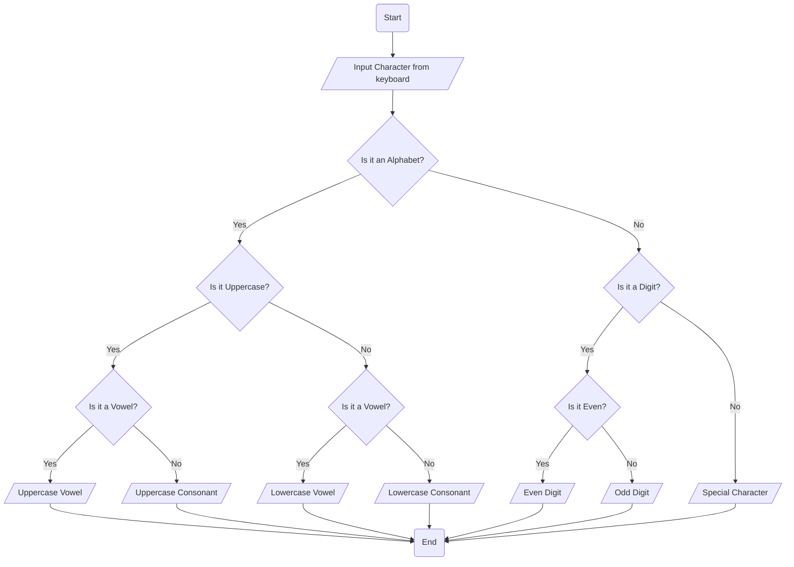

FLOWCHART

```mermaid
graph TD
A(Start) --> B[/Input Character from keyboard/]
B --> C{Is it an Alphabet?}
C -- Yes --> D{Is it Uppercase?}
D -- Yes --> E{Is it a Vowel?}
E -- Yes --> F[/Uppercase Vowel/]
E -- No --> G[/Uppercase Consonant/]
D -- No --> H{Is it a Vowel?}
H -- Yes --> I[/Lowercase Vowel/]
H -- No --> J[/Lowercase Consonant/]
C -- No --> K{Is it a Digit?}
K -- Yes --> L{Is it Even?}
L -- Yes --> M[/Even Digit/]
L -- No --> N[/Odd Digit/]
K -- No --> O[/Special Character/]
F --> Q(End)
G --> Q
I --> Q
J --> Q
M --> Q
N --> Q
O --> Q
```
PROBLEM ANALYSIS 

FLOWCHART 

