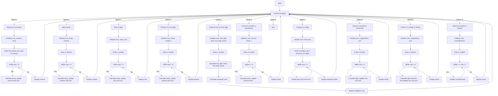

```mermaid 
graph TD
    A[Start] --> B[Choose an option]
    B --> |Option 1| C[Reverse of a number]
    C --> D[Initialize num, reverse, temp]
    D --> E[Enter the number you want to reverse]
    E --> F[While num > 0]
    F --> |Yes| G[Calculate temp, update reverse and num]
    G --> F
    F --> |No| H[Display reverse]
    H --> B

    B --> |Option 2| I[Digit counter]
    I --> J[Initialize num, temp, counter]
    J --> K[Enter a number]
    K --> L[While num > 0]
    L --> |Yes| M[Calculate temp, update counter and num]
    M --> L
    L --> |No| N[Display counter]
    N --> B

    B --> |Option 3| O[Sum of digits]
    O --> P[Initialize num, temp, sum]
    P --> Q[Enter a number]
    Q --> R[While num > 0]
    R --> |Yes| S[Calculate temp, update sum and num]
    S --> R
    R --> |No| T[Display sum]
    T --> B

    B --> |Option 4| U[Product of even digits]
    U --> V[Initialize num, temp, product]
    V --> W[Enter a number]
    W --> X[While num > 0]
    X --> |Yes| Y[Calculate temp, update product and num]
    Y --> X
    X --> |No| Z[Display product]
    Z --> B

    B --> |Option 5| AA[Swap the first and last digit]
    AA --> AB[Initialize num, last_digit, temp, first_digit, power]
    AB --> AC[Enter a number]
    AC --> AD[Calculate last_digit, temp, first_digit, power]
    AD --> AE[Calculate swapped_num]
    AE --> AF[Display swapped_num]
    AF --> B

    B --> |Option 6| AG[Check if a number is palindrome]
    AG --> AH[Initialize num, reverse, temp, n]
    AH --> AI[Enter a number]
    AI --> AJ[While n > 0]
    AJ --> |Yes| AK[Calculate temp, update reverse and n]
    AK --> AJ
    AJ --> |No| AL[Display result]
    AL --> B

    B --> |Option 7| AM[Frequency of digit]
    AM --> AN[Initialize num, freq array]
    AN --> AO[Enter a number with a minimum of 9 digits]
    AO --> AP[While num > 0]
    AP --> AQ[Update freq array and num]
    AQ --> AP
    AP --> AR[Display frequency table]
    AR --> B

    B --> |Option 8| AS[Check if a number is Armstrong]
    AS --> AT[Initialize num, originalNum, sum]
    AT --> AU[Enter a number]
    AU --> AV[While num > 0]
    AV --> AW[Calculate digit, update sum and num]
    AW --> AV
    AV --> AX[Display result]
    AX --> B

    B --> |Option 9| AY[Check if a number is Strong]
    AY --> AZ[Initialize num, originalNum, sum]
    AZ --> BA[Enter a number]
    BA --> BB[While num > 0]
    BB --> BC[Calculate digit, factorial, and update sum and num]
    BC --> BB
    BB --> BD[Display result]
    BD --> B

    B --> |Option 10| BE[Check if a number is Perfect]
    BE --> BF[Initialize num, sumOfDivisors]
    BF --> BG[Enter a number]
    BG --> BH[While i <= num / 2]
    BH --> |Yes| BI[Update sumOfDivisors]
    BI --> BH
    BH --> |No| BJ[Display result]
    BJ --> B

    B --> |Option 0| BK[End]
```
