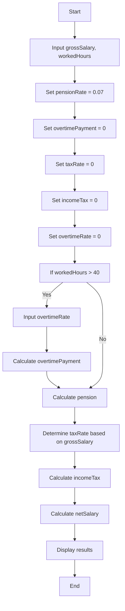

Problem Analysis:

The problem is to create a C++ program that calculates the net salary of an 
employee based on their gross salary, worked hours, overtime bonus rate, 
pension deduction (fixed at 7%), and income tax. The income tax should be 
calculated based on predefined tax rates for different salary ranges. 
The program needs to consider overtime pay for hours worked beyond 
40 hours, where the user can input the overtime bonus rate.

Flowchart:

Pseudocode:

1. Start
2. Input grossSalary, workedHours
3. Set pensionRate = 0.07
4. Set overtimePayment = 0
5. Set taxRate = 0
6. Set incomeTax = 0
7. Set overtimeRate = 0
8. If workedHours > 40:
     a. Input overtimeRate
     b. Calculate overtimePayment = (workedHours - 40) * overtimeRate
9. Calculate pension = grossSalary * pensionRate
10. Determine taxRate based on grossSalary:
    - If grossSalary <= 200, set taxRate = 0
    - If grossSalary <= 600, set taxRate = 0.10
    - If grossSalary <= 1200, set taxRate = 0.15
    - If grossSalary <= 2000, set taxRate = 0.20
    - If grossSalary <= 3500, set taxRate = 0.25
    - Else, set taxRate = 0.30
11. Calculate incomeTax = grossSalary * taxRate
12. Calculate netSalary = (grossSalary - pension - incomeTax) + overtimePayment
13. Display grossSalary, pension, incomeTax, overtimePayment, netSalary
14. End

