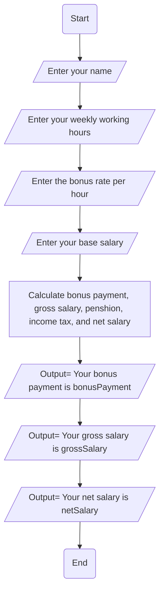

flowchart 

Problem Analysis:

The problem is to develop a program that reads an employee's name, weekly working hours, bonus rate per hour, and base salary. The program needs to calculate and display the employee's gross salary, net salary, and bonus payment, considering a pension rate of 5% and a tax rate of 15%. The key components of the problem include:

Input:

Prompt the user to input the employee's name.
Prompt the user to input the weekly working hours.
Prompt the user to input the bonus rate per hour.
Prompt the user to input the base salary.
Validation:

Ensure that the entered values for weekly working hours, bonus rate per hour, and base salary are valid numerical values.
Calculation:

Calculate the gross salary as the sum of the base salary and the product of weekly working hours and bonus rate per hour.
Calculate the bonus payment as the product of weekly working hours and bonus rate per hour.
Calculate the pension deduction as a percentage (5%) of the gross salary.
Calculate the tax deduction as a percentage (15%) of the gross salary.
Calculate the net salary as the difference between the gross salary and the sum of pension and tax deductions.
Output:

Display the employee's name, gross salary, bonus payment, pension deduction, tax deduction, and net salary.
Algorithm Design:

Input:

Prompt the user to input the employee's name.
Prompt the user to input the weekly working hours.
Prompt the user to input the bonus rate per hour.
Prompt the user to input the base salary.
Validation:

Ensure that the entered values for weekly working hours, bonus rate per hour, and base salary are valid numerical values.
Calculation:

Calculate gross salary = base salary + (weekly working hours * bonus rate per hour).
Calculate bonus payment = weekly working hours * bonus rate per hour.
Calculate pension deduction = 5% of gross salary.
Calculate tax deduction = 15% of gross salary.
Calculate net salary = gross salary - (pension deduction + tax deduction).
Output:

Display the employee's name, gross salary, bonus payment, pension deduction, tax deduction, and net salary.
