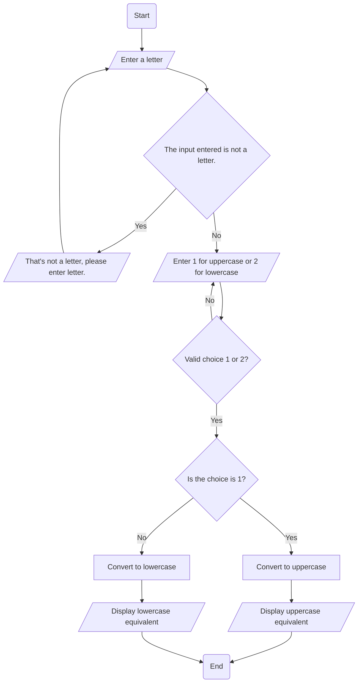

Flowchart 

Problem Analysis:

The problem is to develop a program that takes a letter as input from the keyboard and converts it to its uppercase or lowercase equivalent using functions defined in the ctype.h library header file. The key components of the problem include:

Input: The program needs to prompt the user to enter a letter.
Validation: Ensure that the entered value is a valid letter.
Conversion: Use the functions toupper and tolower from the ctype.h library to convert the letter to its uppercase or lowercase equivalent.
Output: Display the converted letter.

