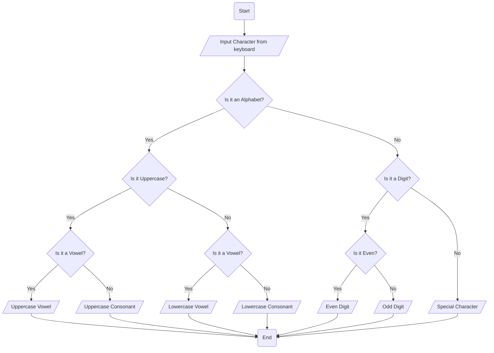

      Problem Analysis 

   Input - Character 

  Output -Identification of character 
     
      Process 

  Variable declaration 
  
  Read input 
  
  Check the input 
  
  Print output 
    
    Algorithm design 

    Pseudo code 

Step 1- start

Step 2- Variable declaration with data type character 

Step 3- check the input data if it is letter, digit (odd,even) or special character 
  
  -if it is letter then check it whether it is  vowel or consonant 
 
  - if  it is digit then check it Whether it is odd or even

Step 4- print the out put 

Spet5- Stop

       Flow chart 

