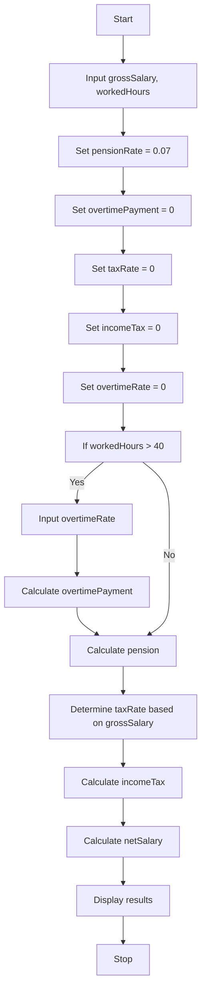

       Problem  analysis 

   input = gross salary, worked hour, bonus rate and income tax rate.
 
   output = net salary
   
      process   
   
   income tax  = gross salary * income tax rate
       
pension = gross salary * 0.07

check whether worked hour > 40.

 if worked hour > 40 then over time payment = (worked_hours-40)*bonus rate
           
if it doesn't over time payment = 0;
        
net_salary =  (gross_salary -(income_tax + pension) ) + over_time_payment

  
     Pseudocode   :

Step 1.Start

step 2.Input grossSalary, workedHours

step 3.Set pensionRate = 0.07

step 4.Set overtimePayment = 0

step 5.Set taxRate = 0

step 6.Set incomeTax = 0

step 7.Set overtimeRate = 0

step 8.If workedHours > 40: a. Input overtimeRate b. Calculate overtimePayment = (workedHours - 40) * overtimeRate

step 9.Calculate pension = grossSalary * pensionRate

step 10.Determine taxRate based on grossSalary:
  
  - If grossSalary <= 200, set taxRate = 0

  - If grossSalary <= 600, set taxRate = 0.10

  - If grossSalary <= 1200, set taxRate = 0.15
  
  - If grossSalary <= 2000, set taxRate = 0.20
  
  - If grossSalary <= 3500, set taxRate = 0.25

  -  Else , set taxRate = 0.30

step 11.Calculate incomeTax = grossSalary * taxRate

step 12.Calculate netSalary = (grossSalary - pension - incomeTax) + overtimePayment

step 13.Display grossSalary, pension, incomeTax, overtimePayment, netSalary

step 14.stop

       Flowchart

