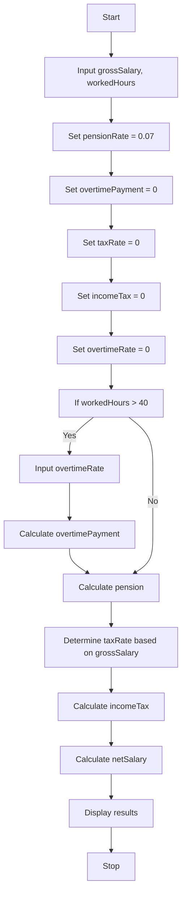

       Problem  analysis 
The problem is to develop a program or code that computes an employee's net salary by taking into account their gross salary, hours worked, overtime bonus rate, pension deduction , and income tax. The income tax calculation should be based on predetermined tax rates for various salary brackets. The program should also factor in overtime compensation for hours worked beyond 40 hours, allowing the user to input the overtime bonus rate.

    Pseudocode   :

Step 1.Start

step 2.Input grossSalary, workedHours

step 3.Set pensionRate = 0.07

step 4.Set overtimePayment = 0

step 5.Set taxRate = 0

step 6.Set incomeTax = 0

step 7.Set overtimeRate = 0

step 8.If workedHours > 40: a. Input overtimeRate b. Calculate overtimePayment = (workedHours - 40) * overtimeRate

step 9.Calculate pension = grossSalary * pensionRate

step 10.Determine taxRate based on grossSalary:
  
  - If grossSalary <= 200, set taxRate = 0

  - If grossSalary <= 600, set taxRate = 0.10

  - If grossSalary <= 1200, set taxRate = 0.15
  
  - If grossSalary <= 2000, set taxRate = 0.20
  
  - If grossSalary <= 3500, set taxRate = 0.25

  -  Else , set taxRate = 0.30

step 11.Calculate incomeTax = grossSalary * taxRate

step 12.Calculate netSalary = (grossSalary - pension - incomeTax) + overtimePayment

step 13.Display grossSalary, pension, incomeTax, overtimePayment, netSalary

step 14.stop

       Flowchart

