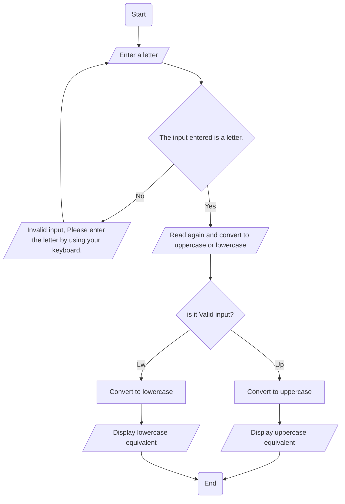

3. Write program that converts a letter entered from the keyboard to its uppercase or 
lowercase equivalent (Hint: use the function defined in ctype.h library header file).
➢ Problem analysis
Input
✓ Letter 
✓
Output
✓ Uppercase letter
✓ Lowercase letter
➢ Process or Operation
▪ Variable declaration: that holds an input from the keyboard and operational results.
▪ Print input prompt message and read corresponding input data.
▪ Converts a letter entered from the keyboard.
▪ Print output prompt message and process result (uppercase and lowercase letter).
➢ Design the program
• Variable declaration (What and How)
char letter, uppercaseLetter, lowercaseLetter;
• Reading input data (How)
Cout << “please enter the letter by using your keyboard ”;
Cin >> letter;
convert to uppercase or lowercase
if (isalpha(letter)) { chr upercaseLetter = toupper(letter)
 chr lowercaseLetter = tolower(letter)
 cout << “upper letter” <<uppercaseLetter<< “lower letter” <<lowercaseLetter;} 
else {cout << “Invalid,…..”}

Flowchart 

