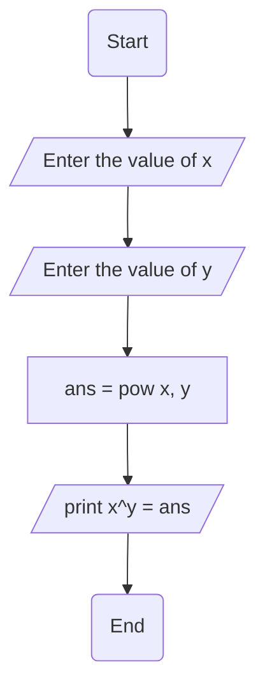

4. Write a program that find the result of the expression x^y where the 
value of x and y are entered by the user.
➢ Problem analysis
Input
✓ X value 
✓ Y value
Output
✓ Display result of expression
➢ Process or Operation
▪ Variable declaration: that holds an input and operational results.
▪ Print input prompt message and read corresponding input data.
▪ Calculate the result of the expressions (xY).
▪ Print output prompt message and process result (xy
).
➢ Design the program
• Variable declaration (What and How).
Float x, y, result;
• Reading input data (How)
Cout << “please enter the x value and the y value ”;
Cin >> x, >> y;
Result = pow(x, y);
Cout << “The result of the expression is: ” << x << “^” <<y << “ = ” <<result;

Flowchart

