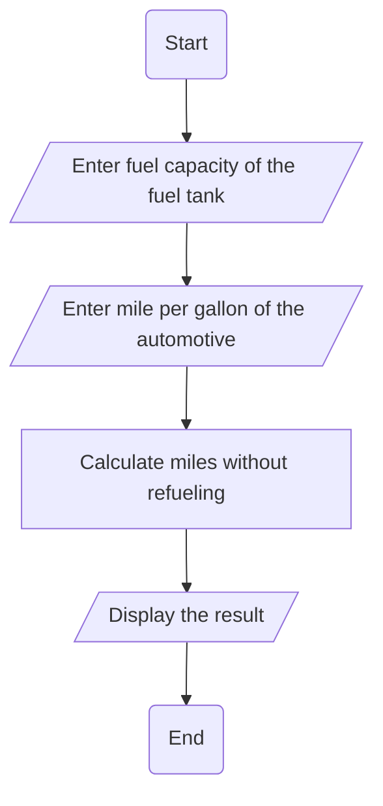

2. Write a program that prompts should read the capacity in gallons of an automobile 
fuel tank and the miles per gallons the automobiles can be driven. the program out 
puts the number of miles the automobile can be driven without refueling.
➢ Problem analysis
Input
✓ Tank capacity
✓ Mile_per_gallon
Output
✓ Display num_mile
➢ Process or Operation
▪ Variable declaration: that holds an input and operational results.
▪ Initializing mile_per_gallons to zero.
▪ Print input prompt message and read corresponding input data.
▪ Calculate the miles or number of miles.
▪ Print output prompt message and process result (num_mile).
➢ Design the program
• Variable declaration and Initialization (What and How).
Float tankCapacity, milePerGallon, numMiles;
• Reading input data (How)
Cout << “please enter the capacity in gallons of fuel and the miles per gallons ”;
Cin >> tankCapacity, >> milePerGallon;
numMile = tankCapacity * milePerGallon;
Cout << “The miles of the automobile can be driven without refueling is: ” << BMI << “Kg/m2”;

Flowchart 

