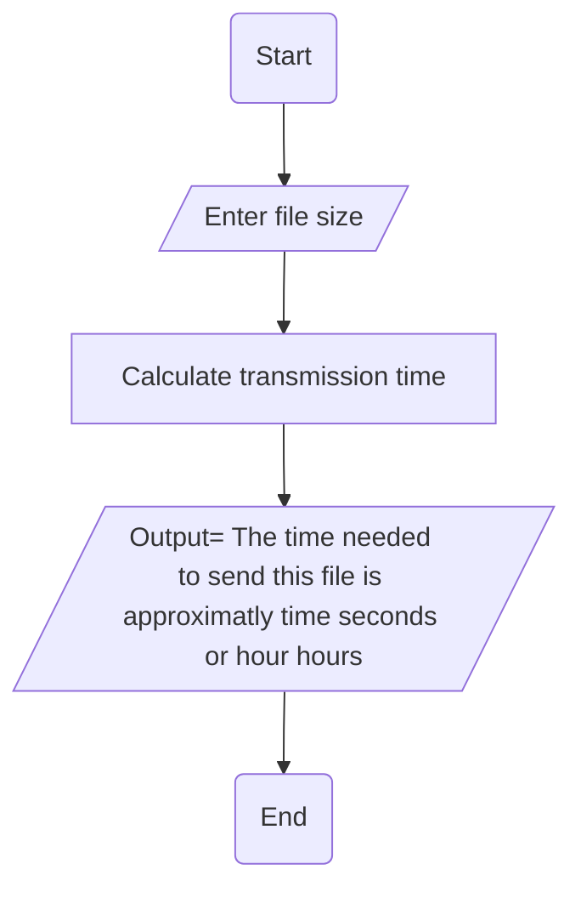

6. A serial transmission line can transmit 960 characters a second. write a program 
that will calculate how long it will take to send a file, given the file size, test your 
program on a 400MB (419430400byte) file which may take days.
➢ Problem analysis
Input
✓ File_size
✓
Output
✓ Time_taken
➢ Process or Operation
▪ Variable declaration to store files: that holds an input from keyboard and operational results.
▪ Print input prompt message and read corresponding input data.
▪ Calculate transmission time(time taken).
▪ Print output prompt message and process result Time taken.
➢ Design the program
• Variable declaration to store the file size. (What and How)
const int transmission_speed = 960; int file_size;
• Reading input data (How)
cout << “please enter the size of file to be sent in bytes: ”; cin >> file_size;
calculate transmission time 
double time_taken = (file_size)/(transmission_speed);
cout << “Estimated time to send the file: ” << time_taken << “ seconds” <<endl;

flowchart 

