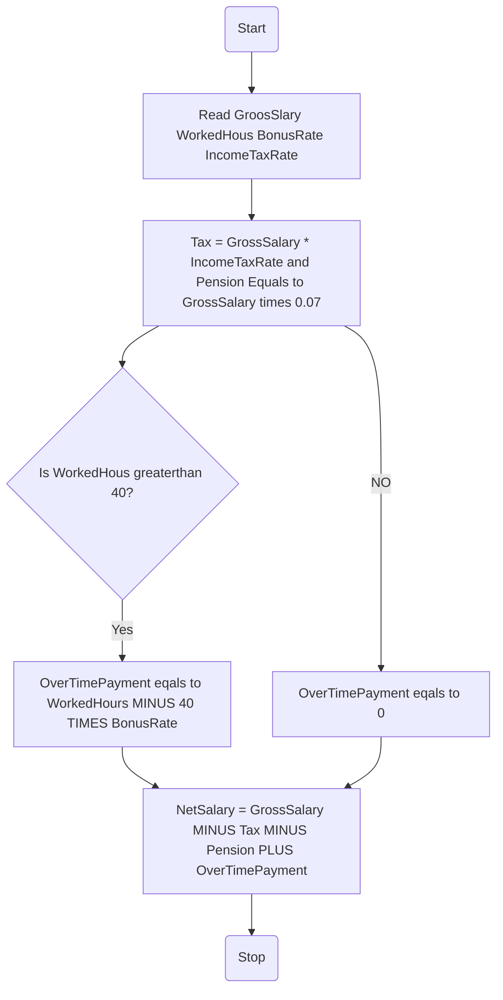

```mermaid
graph TD;
A(Start) --> B[Read GroosSlary WorkedHous BonusRate IncomeTaxRate]
B --> C[Tax = GrossSalary * IncomeTaxRate and Pension Equals to GrossSalary times 0.07]
C --> D{Is WorkedHous greaterthan 40?}
D -- Yes --> E[OverTimePayment eqals to WorkedHours MINUS 40 TIMES BonusRate]
E --> G[NetSalary = GrossSalary MINUS Tax MINUS Pension PLUS OverTimePayment ]
C -- NO --> F[OverTimePayment eqals to 0]
F --> G[NetSalary = GrossSalary MINUS Tax MINUS Pension PLUS OverTimePayment ]
G --> H(Stop)
```
