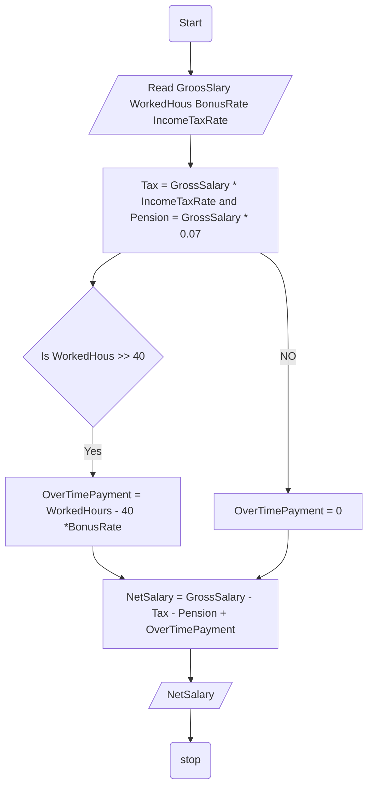

```mermaid
graph TD;
A(Start) --> B[/Read GroosSlary WorkedHous BonusRate IncomeTaxRate/]
B --> C[Tax = GrossSalary * IncomeTaxRate and Pension = GrossSalary * 0.07]
C --> D{Is WorkedHous >> 40}
D -- Yes --> E[OverTimePayment = WorkedHours - 40  *BonusRate]
E --> G[NetSalary = GrossSalary - Tax - Pension + OverTimePayment ]
C -- NO --> F[OverTimePayment = 0]
F --> G[NetSalary = GrossSalary - Tax - Pension + OverTimePayment ]
G --> H[/NetSalary/]
H --> I(stop) 
```
