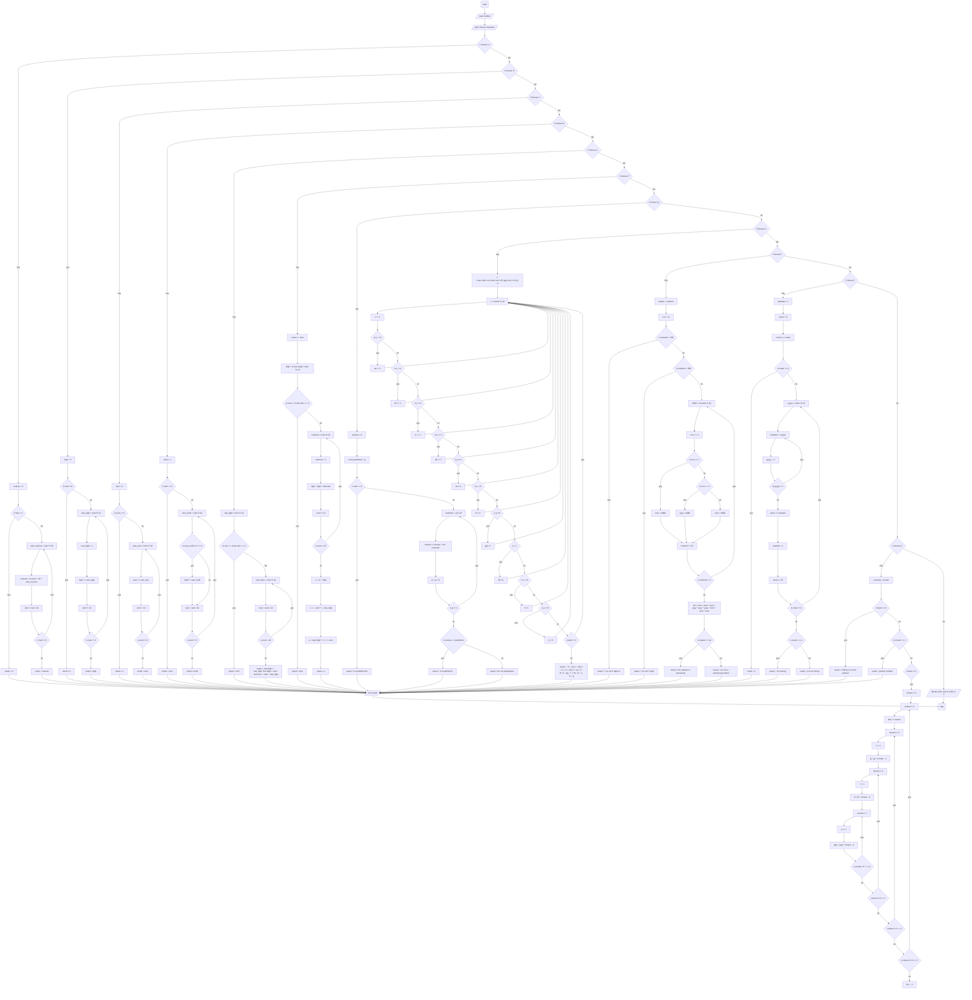

```mermaid
graph TD
a(start) --> b[/raed number/]
b-->c[/ print choose character/]
c-->d{if choose 'a'}
d-- Yes -->e[reverse = 0]
e -->e1{if num = 0}
e1 -- Yes --> e2[result = 0]
e2 --> zz
e1 -- No --> e3[ new_reverse = num % 10]
e3 -->e4[reverse = reverse * 10 + new_reverse]
e4 --> e5[num = num / 10]
e5 -->e6{is num != 0}
e6 -- Yes --> e3
e6 -- no --> e7[result = reverse]
e7 --> zz[/print result/]
d-- No -->f{if choose 'b'}
f-- yes -->g[digit = 0]
g --> g1{if num ==0 }
g1 -- yes --> g2[result = 0]
g2 --> zz
g1 -- no -->g3[new_digit = num % 10]
g3 --> g4[new_digit = 1]
g4 --> g5[digit += new_digit]
g5 --> g6[ num /= 10]
g6 --> g7{is num != 0}
g7 -- yes --> g3
g7 -- no --> g8[result = digit]
g8 -->zz
f -- No --> h{if choose 'c'}
h -- Yes --> i[sum = 0]
i --> i1{is num == 0}
i1 -- yes -->i2[result = 0]
i2 --> zz
i1 -- no --> i3[new_sum = num % 10]
i3 --> i4[sum += new_sum]
i4 --> i5[num /= 10]
i5 --> i6{is num != 0}
i6 -- yes --> i3
i6 -- no --> i7[result = sum]
i7 --> zz
h -- No --> j{if choose 'd'}
j -- Yes --> k[multi = 1]
k --> k1{is num == 0}
k1 -- yes -->k2[result = num]
k2 --> zz
k1 -- no -->k3[new_multi = num % 10]
k3 --> k4{is new_multi % 2 == 0}
k4 -- yes -->k5[multi *= new_multi]
k5 --> k6
k4 -- no --> k6[num = num / 10]
k6 --> k7{is num != 0}
k7 -- yes -->k3
k7 -- no -->k8[result = multi]
k8 --> zz
j -- No --> l{if choose 'e'}
l -- Yes --> m[last_digit = num % 10]
m --> m1{is num <= 9 && num >= -9}
m1 -- yes --> m2[result = num]
m2 --> zz
m1 -- No --> m3[new_Num = num % 10]
m3 --> m4[num = num / 10]
m4 --> m5{is num > 10}
m5 -- yes -->m3
m5 -- no -->m7[result = 'last digit = ' last_digit, 'first digit = 'num 'and sum = 'num + last_digit]
m7 --> zz
l -- No --> n{if choose 'f'}
n -- Yes --> o[const x = num]
o --> o1[digit = 0, last_Digit = num % 10]
o1 --> o2{is num <= 9 && num >= -9}
o2 -- yes --> o3[result = num]
o3 --> zz
o2 -- no --> o4[newnum = num % 10]
o4 --> o5[newnum = 1]
o5 --> o6[digit = digit + newnum]
o6 --> o7[num /= 10]
o7 --> o8{is num > 10}
o8 -- yes --> o4
o8 -- no --> o9[ v = 1o ^ digit]
o9 -->o11[c = x - num * v - last_Digit]
o11 --> o12[a = last_Digit * v + c + num]
o12 -->o13[result = a]
o13 -->zz
n -- No --> p{if choose 'g'}
p -- Yes --> q[reverse = 0]
q --> q1[const palindrom = g]
q1 --> q2{is num == 0}
q2 -- yes -->q3[result = 'it is palindrome']
q3 --> zz
q2 -- no -->q4[newNum = g % 10]
q4 --> q5[reverse = reverse * 10 + newNum]
q5 --> q6[g = g / 10]
q6 --> q7{is g != 0}
q7 -- yes-->q4
q7 -- no -->q8{is reverse == palindrom}
q8 -- yes --> q9[result = 'it is palindrom']
q9 --> zz
q8 -- no -->q11[result ='it is not palindrome']
q11 --> zz
p -- No --> r{if choose 'h'}
r -- Yes --> s[z ==aa==bb==cc==dd==ee==ff==gg==hh==ii==jj=  0]
s --> s1[y = numm % 10]
s1 -->s3[z += 1]
s3 --> s4{is y == 0}
s4 -- yes -->s5[ aa += 1]
s5 --> s1
s4 -- no --> s6{is y ==1}
s6 -- yes --> s7[ bb += 1]
s7 --> s1
s6 -- no --> s8{is y ==2}
s8 -- yes --> s9[ cc += 1]
s9 --> s1
s8 -- no --> s11{is y == 3}
s11 -- yes -->s12[dd += 3]
s12 --> s1
s11 -- no --> s13{is y==4}
s13 -- yes --> s14[ee+=1]
s14 --> s1
s13 -- no --> s15{is y ==5}
s15 -- yes --> s16[ff +=1]
s16 --> s1
s15 -- no --> s17{is y==6}
s17 -- yes --> s18[gg+=1]
s18 --> s1
s17 -- no --> s19{y == 7}
s19 -- yes -->s20[hh+=1]
s20 --> s1
s19 -- no -->s21{ is y ==8}
s21 -- yes -->s22[ii+=1]
s22 --> s1
s21 -- no -->s23{is y ==9}
s23 -- yes --> s24[jj +=1]
s24 --> s1
s23 -- no --> s2{numm != 0}
s2 -- yes --> s1
s2 -- no --> s25[result =  '0 = 'aa,'1 = 'bb',2 = 'cc ,'3 = 'dd,'4 = 'ee, '5 = 'ff, '6 = 'gg, '7 = 'hh, '8 = 'ii, '9 = 'jj]
s25 --> zz
r -- No --> t{if choose 'i'}
t -- Yes --> u[wwww = nummm]
u --> u1[cccc = 0]
u1 --> u2{is nummm < 100}
u2 -- yes -->u3[result = 'it is not 3 digit so']
u3 --> zz
u2 -- no --> u4{id nummm > 999}
u4 -- yes --> u5[result = 'it is not 3 digit']
u5 --> zz
u4 -- no -->u6[bbbb = nummm % 10]
u6 --> u7[cccc += 1]
u7 --> u8{is cccc == 1}
u8 -- yes -->u9[xxxx = bbbb]
u9 --> u13
u8 -- no -->u10{is cccc == 2}
u10 -- yes --> u11[yyyy = bbbb]
u11 --> u13
u10 -- no --> u12[ zzzz = bbbb]
u12 --> u13[nummm /= 10]
u13 --> u14{is nummm != 0}
u14 -- yes --> u6
u14 -- no --> u15[cal = xxxx * xxxx * xxxx + yyyy * yyyy * yyyy + zzzz * zzzz * zzzz]
u15 --> u16{is wwww == cal}
u16 -- yes --> u17[result = the number is armstrong]
u17 --> zz
u16 -- no --> u18[result = it is not a armstrong number]
u18 --> zz
t -- No --> v{if choose 'j'}
v -- Yes --> w[ wwwww = 1]
w --> w1[zzzzz = 0]
w1 --> w2[const vv = nnum]
w2 --> w3{ is nnum == 0}
w3 -- yes --> w4[result = 0]
w4 --> zz
w3 -- no --> w5[yyyyy = nnum % 10]
w5 --> w6[wwwww *= yyyyy]
w6 --> w7[yyyyy -= 1]
w7 --> w8{is yyyyy != 1}
w8 -- yes --> w6
w8 -- no -->w9[zzzzz += wwwww]
w9 --> w10[wwwww = 1]
w10 --> w11[nnum /= 10]
w11 --> w12{is nnum != 0}
w12 -- yes -->w5
w12 -- no -->w13{is zzzzz == vv}
w13 -- yes --> w14[result = 'it is strong']
w14 --> zz
w13 -- no --> w15[result = it is not strong]
w15 --> zz
v -- No --> x{if choose 'k'}
x -- Yes --> y[const qq = nnnum]
y --> y1{nnnum == 0}
y1 -- yes -->y2[result = 'infinity, so it isn't perfect']
y2 --> zz
y1 --no -->y3{is nnnum == 1}
y3 -- yes --> y4[result = 'perfect number']
y4 --> zz
y3 -- no --> y5{nnnum != 0}
y5 -- yes -->y6[nnnum /= 2]
y6 --> y7[nnnum /= 2]
y7 --> y8[kkk += nnnum]
y8 --> y9[nnnum /= 3]
y9 --> y10[j += 1]
y10 --> y11[jjj = jjj + nnnum - 4]
y11 --> y12[ nnnum /= 5]
y12 --> y13[l += 1]
y13 --> y14[lll = lll + nnnum - 6]
y14 --> y15[nnnum /= 7]
y15 --> y16[p += 1]
y16 --> y17[ppp = ppp + nnnum - 8]
y17 --> y18{is nnnum % 7 == 0}
y18 -- yes -->y15
y18 -- no -->y19{nnnum % 5 == 0}
y19 -- yes --> y12
y19 -- no --> y20{nnnum % 3 == 0}
y20 -- yes --> y9
y20 -- no --> y21{is nnnum % 2 == 0}
y21 -- yes --> y7
y21 -- no --> y22[kk =  , k]

x -- No --> z[/please ame sure to enter a-k /]
z --> zzz
zz --> zzz(stop)
```
