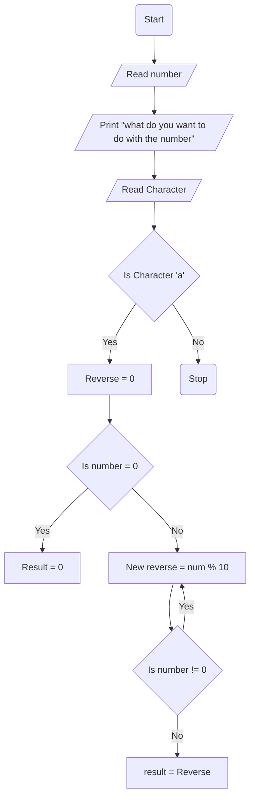

```mermaid
graph TD
A(Start) --> B[/Read number/]
B --> C[/Print "what do you want to do with the number"/]
C --> D[/Read Character/]
D --> E{Is Character 'a'}
E -- Yes --> F[Reverse = 0]
F --> G{Is number = 0}
G -- Yes --> H[Result = 0]
G -- No --> I[New reverse = num % 10]
I --> J{Is number != 0}
J -- Yes --> I
J -- No --> K[result = Reverse]
E -- No --> L(Stop)
```
