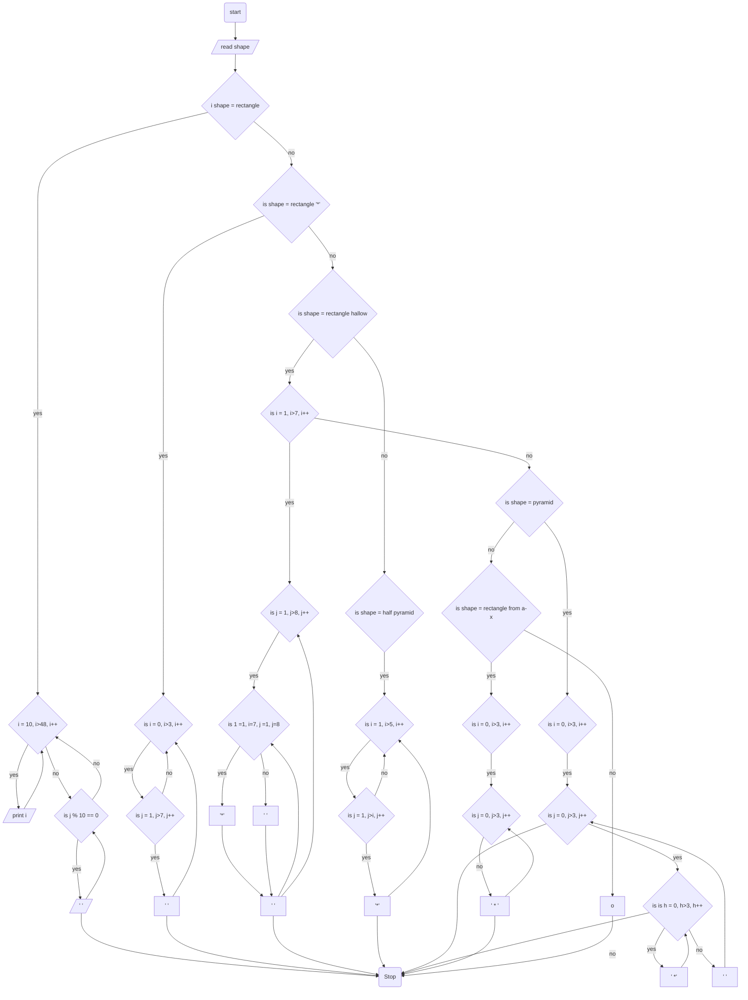

```mermaid
graph TD
a(start) --> b[/ read shape/]
b --> c{i shape = rectangle}
c -- yes --> d{i = 10, i>48, i++}
d -- yes --> d1[/print i/]
d1 -->d
d -- no -->d2{is j % 10 == 0}
d2 -- yes --> d3[/' '/]
d3 -->d2
d2 -- no -->d
d3 -->q
c -- no --> e{is shape = rectangle '*'}
e -- yes --> f{is i = 0, i>3, i++ }
f --yes -->f1{is j = 1, j>7, j++}
f1 -- yes -->f2[' ']
f2 --> f
f2 --> q
f1 -- no -->f
e -- no --> g{is shape = rectangle hallow}
g -- yes --> i{is i = 1, i>7, i++}
i --yes -->i1{is j = 1, j>8, j++}
i1 -- yes --> i2{is 1 =1, i=7, j =1, j=8 }
i2 -- yes --> i3['*']
i2 -- no --> i4[' ']
i3 --> i5[' ']
i4 --> i5
i5 --> i2
i5 --> i1
i5 --> q
g -- no --> h{is shape = half pyramid}
h -- yes --> j{is i = 1, i>5, i++}
j -- yes --> j1{is j = 1, j>i, j++}
j1 -- yes --> j2['*']
j1 -- no --> j
j2 --> j
j2 --> q
i -- no --> k{is shape = pyramid}
k -- yes --> l{is  i = 0, i>3, i++}
l -- yes --> l1{is j = 0, j>3, j++}
l1 -- yes --> l2{is is h = 0, h>3, h++}
l2 --yes --> l3[' *']
l2 -- no --> l4[' ']
l4 --> l1
l1 --> q
l2 --> q
l3 --> l2
k -- no --> m{is shape = rectangle from a-x}
m -- yes --> n{is i = 0, i>3, i++}
n --yes -->n1{is j = 0, j>3, j++}
n1 -- no --> n2[' * ']
n2 --> n1
n2 --> q
m -- no -->o
o -- no -->q(Stop)
```
