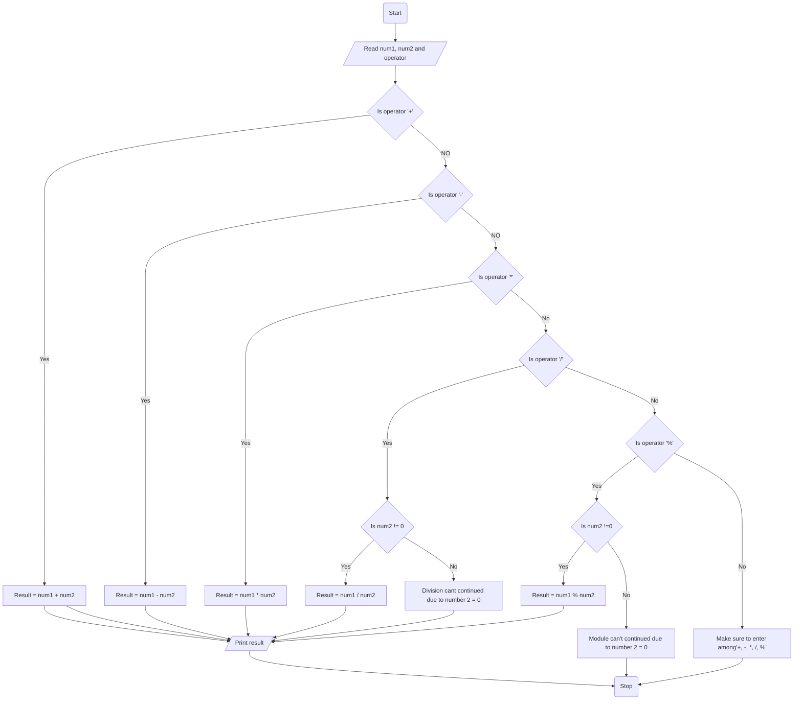

```mermaid
graph TD
A(Start) --> B[/Read num1, num2 and operator/]
B --> C{Is operator '+'}
C -- Yes --> D[Result = num1 + num2]
C -- NO --> E{Is operator '-'}
E -- Yes --> F[Result = num1 - num2]
E -- NO --> G{Is operator '*'}
G -- Yes --> H[Result = num1 * num2]
G -- No --> I{Is operator '/'}
I -- Yes --> J{Is num2 != 0}
J -- Yes --> K[Result = num1 / num2]
J -- No --> L[Division cant continued due to number 2 = 0]
I -- No --> M{Is operator '%'}
M -- Yes --> N{Is num2 !=0}
N -- Yes --> O[Result = num1 % num2]
N -- No --> P[Module can't continued due to number 2 = 0]
M -- No --> Q[Make sure to enter among'+, -, *, /, %']
Q --> S(Stop)
D --> R[/Print result/]
F --> R[/Print result/]
D --> R[/Print result/]
H --> R[/Print result/]
K --> R[/Print result/]
L --> R[/Print result/]
O --> R[/Print result/]
P --> S
R --> S
```
