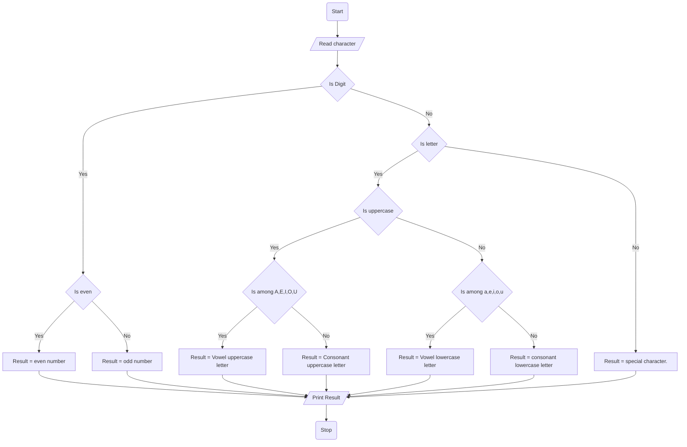

```mermaid
graph TD
A(Start) --> B[/Read character/]
B --> C{Is Digit}
C -- Yes --> D{Is even}
D -- Yes --> E[Result = even number]
D -- No --> F[Result = odd number]
C -- No --> G{Is letter}
G -- Yes --> H{Is uppercase}
H -- Yes --> I{Is among A,E,I,O,U}
I -- Yes -->J[Result = Vowel uppercase letter]
I -- No --> K[Result = Consonant uppercase letter]
H -- No --> L{Is among a,e,i,o,u}
L -- Yes --> M[Result = Vowel lowercase letter]
L -- No --> N[Result = consonant lowercase letter]
G -- No --> O[Result = special character.]
O --> P[/Print Result/]
E --> P[/Print Result/]
F --> P[/Print Result/]
J --> P[/Print Result/]
K --> P[/Print Result/]
M --> P[/Print Result/]
N --> P[/Print Result/]
P --> Q(Stop)
``` 
