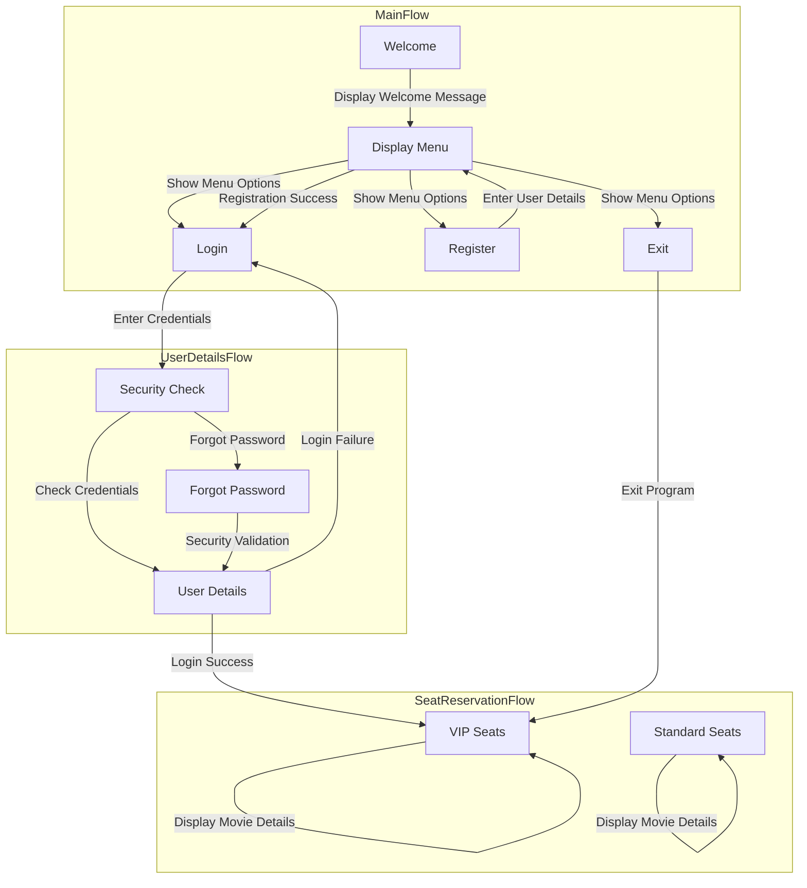

FLOWCHART 

PSEUDOCODE 

1. Initialize:
    - Constants: Col = 10, MaxUsers = 100
    - Structures: User
        - Fields: fullName, username, password, securityWord, age
    - Arrays: users[MaxUsers], vipSeats[3][Col], standardSeats[7][Col]

2. Main():
    a. Display Welcome Message

    b. while True:
        i. Display Menu Options
        ii. Input choice1

        iii. switch choice1:
            case 1:
                - username, password = InputCredentials()
                - if AuthenticateUser(username, password):
                    - DisplayMovieReservationMenu()
                    - choice2 = InputChoice()
                    - ReserveSeat(choice2, users[userIndex])
                - else:
                    - DisplayLoginError()
                    - HandleForgotPassword()

            case 2:
                - if userCount < MaxUsers:
                    - newUser = InputUserDetails()
                    - users[userCount] = newUser
                    - userCount++
                    - DisplayRegistrationSuccess()
                - else:
                    - DisplayRegistrationLimitReached()

            case 3:
                - DisplayExitMessage()
                - ExitProgram()

            default:
                - DisplayInvalidChoiceError()

3. MovieReservation():
    a. while True:
        i. DisplaySeatOptions()
        ii. Input seatChoice

        iii. switch seatChoice:
            case 1:
                - DisplayVIPSeatingArrangement()
                - userGenre, seatPrice = InputMovieDetails()
                - userPayment, tax = InputPayment()
                - ReserveVIPSeat(userGenre, seatPrice, userPayment, tax)

            case 2:
                - DisplayStandardSeatingArrangement()
                - userGenre, seatPrice = InputMovieDetails()
                - userPayment, tax = InputPayment()
                - ReserveStandardSeat(userGenre, seatPrice, userPayment, tax)

            case 3:
                - ExitMovieReservation()

            default:
                - DisplayInvalidChoiceError()
